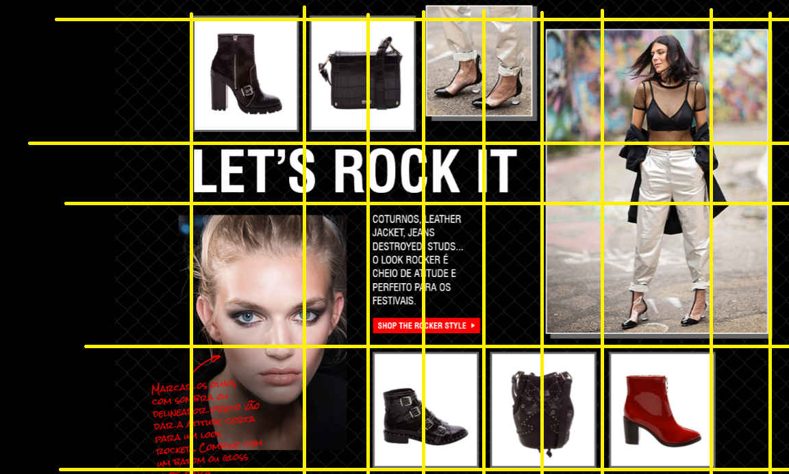
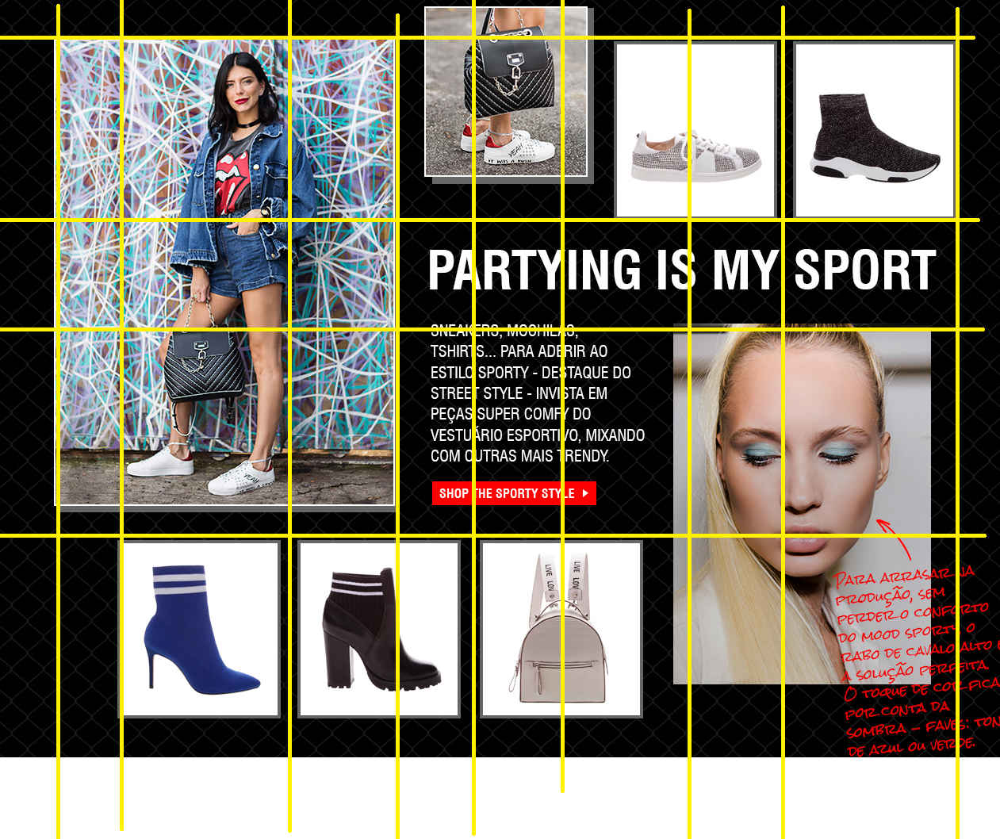
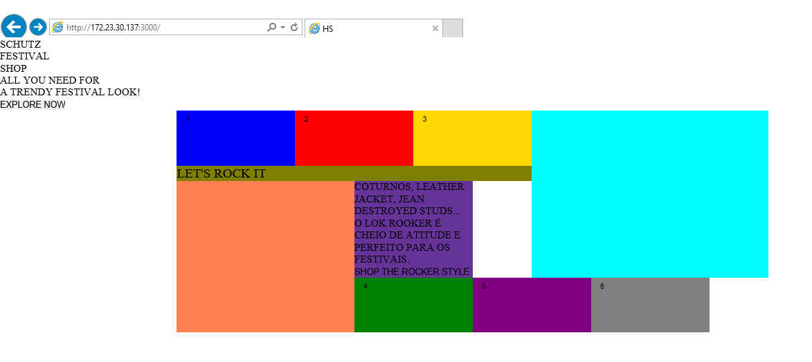
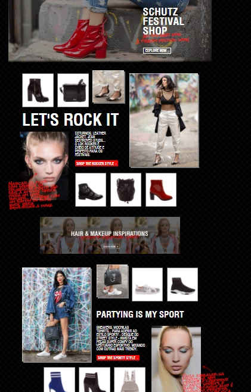
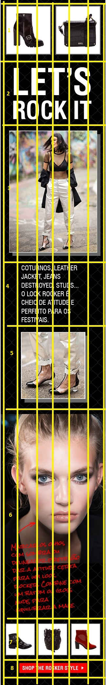

# HOTSITE - FESTIVAL SHOP (SHUTZ)
[retornar](../../README.md)

Recebido layout do novo Hotsite promocional da marca Schutz.
Todo Hotsite é feito no ambiente de hotsites criado pela equipe [Hotsite-template](https://github.com/jomarcardoso/estagio-supervisionado/blob/master/extras/hotsites-template.md)

[Layout desktop](arquivos/hotsite-fs-desktop.jpg)

## Estruturando

Pelo fato das imagens das "prateleiras" de produtos estarem em uma ordem não convencional decidi usar grid-layout para organizar.

**Desenhei o grid no paint:**




Por precisar dar suporte ao Internet Explorer 11, fiz o mesmo de forma compatível

```
.fs-shelf {
    display: grid;
    display: -ms-grid;

    &--odd {
        -ms-grid-columns: 20% 10% 10% 10% 10% 10% 20% 10%;
        grid-template-columns: 2fr 1fr 1fr 1fr 1fr 1fr 2fr 1fr;
    }

    &--even {
        -ms-grid-columns: 10% 20% 10% 10% 10% 10% 10% 20%;
        grid-template-columns: 1fr 2fr 1fr 1fr 1fr 1fr 1fr 2fr;
    }

    -ms-grid-rows: 28.57% 14.2857% 28.57% 28.57%;
    grid-template-rows: 2fr 1fr 2fr 2fr;
}

.fs-shelf__product--1 {
    -ms-grid-row: 1;
    -ms-grid-row-span: 1;
    grid-row: 1 / span 1;
    -ms-grid-column: 8;
    -ms-grid-column-span: 1;
    grid-column: 8 / span 1;
}
```

Nesta forma de trabalhar cada item diz a sua posição e não o container.

**Resultado:**



**Horas trabalhadas:** 5

## Versão Desktop
Continuado o trabalho, inserindo html e CSS.
Versão Desktop concluída, com alguns ajustes pendentes.




**Horas trabalhadas:** 18

## Versão Mobile


[Layout Mobile](arquivos/hotsite-fs-mobile.jpg)

A versão mobile chegou depois da desktop, então eu não sabia como precisava organizar os elementos HTML, mas como optei por usar display: grid, a conversão foi mais simples.

Fiz novamente o grid no Paint:


Não esperava que o botão de compra mudasse de lugar no grid, coloquei ele para baixo com position: absolute.

Versão Mobile concluída com todos os alinhamentos e o carrossel funcionando.

Adicionado todos os links e ajustado a responsividade para demais

Como a página vai dentro de outra da plataforma Hybris houve conflito de CSS e precisei sobrescrever alguns.

[retornar](../../README.md)